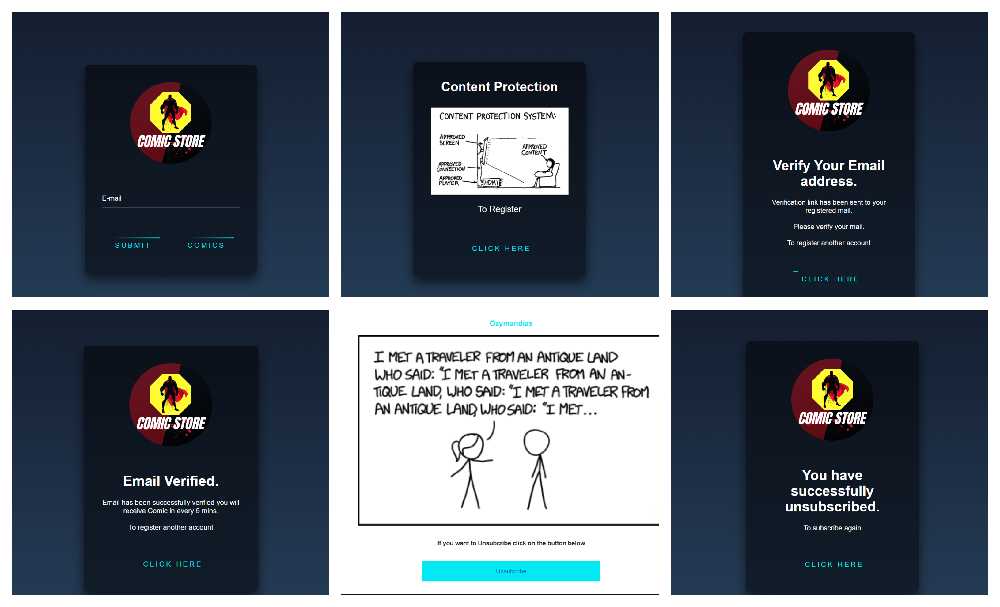

<div align="center">
    
    <h1>Comic Store</h1>
    <p>
        Why so serious!! Lets read comics 
    </p>
    <p>
        https://rjsaurav13.online/ 
    </p>
    <h4>
        <a href="https://github.com/rtlearn/php-rjsaurav13">View Demo</a>
        <span> · </span>
        <a href="https://github.com/rtlearn/php-rjsaurav13/issues">Report Bug</a>
        <span> · </span>
        <a href="https://github.com/rtlearn/php-rjsaurav13/issues">Request Feature</a>
    </h4>
</div>

## :notebook_with_decorative_cover: Table of Contents

- [About the Project](#star2-about-the-project)
  - [Screenshots](#camera-screenshots)
  - [Tech Stack](#space_invader-tech-stack)
  - [Features](#dart-features)
- [Getting Started](#toolbox-getting-started)
- [Contact](#handshake-contact)
- [Acknowledgements](#gem-acknowledgements)

## :star2: About the Project

### :camera: Screenshots

<div align="center"> 
  
</div>

### :space_invader: Tech Stack

<details>
  <summary>Client</summary>
  <ul>
    <li>HTML</li>
    <li>CSS</li>
    <li>JavaScript</li>
  </ul>
</details>
<details>
  <summary>Server</summary>
  <ul>
    <li>PHP</li>
  </ul>
</details>
<details>
<summary>Database</summary>
  <ul>
    <li>MySQL</li>
  </ul>
</details>
<details>
<summary>DevOps Tool</summary>
  <ul>
    <li>Git</li>
  </ul>
</details>

### :dart: Features

- User can access comics by registering
- Comic API is integrated
- Verification of user
- User will receive comic every 5 minutes in mail
- User can unsubscribe

## :toolbox: Getting Started

### :running: Run Locally

#### Clone the project

```bash
  git clone https://github.com/rtlearn/php-rjsaurav13.git
```

### Install XAMPP

#### Create Database


## :handshake: Contact

Invite me to connect

```bash
  rjsaurav13@gmail.com
```

Thank you for being here!

```javascript
if (isAwesome) {
  // Give a ⭐  :p
  starThisRepository();
}
```
